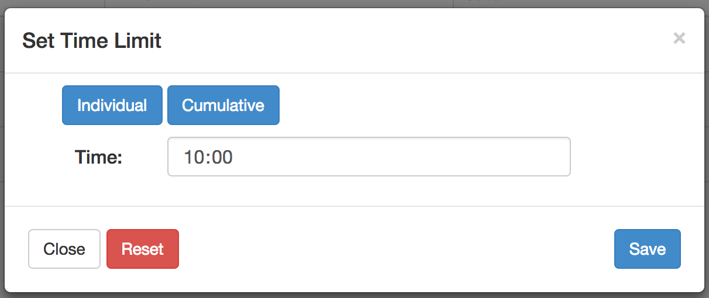
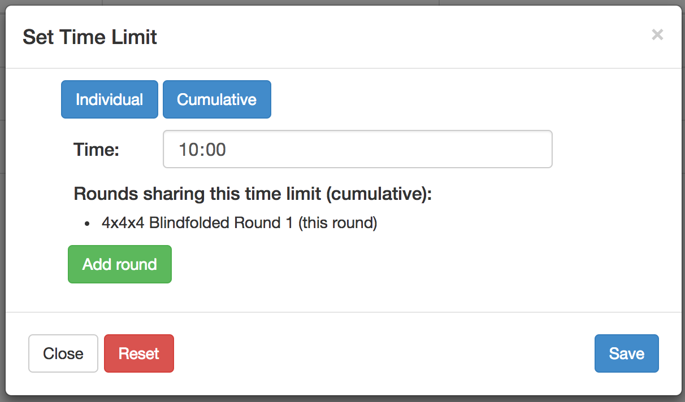
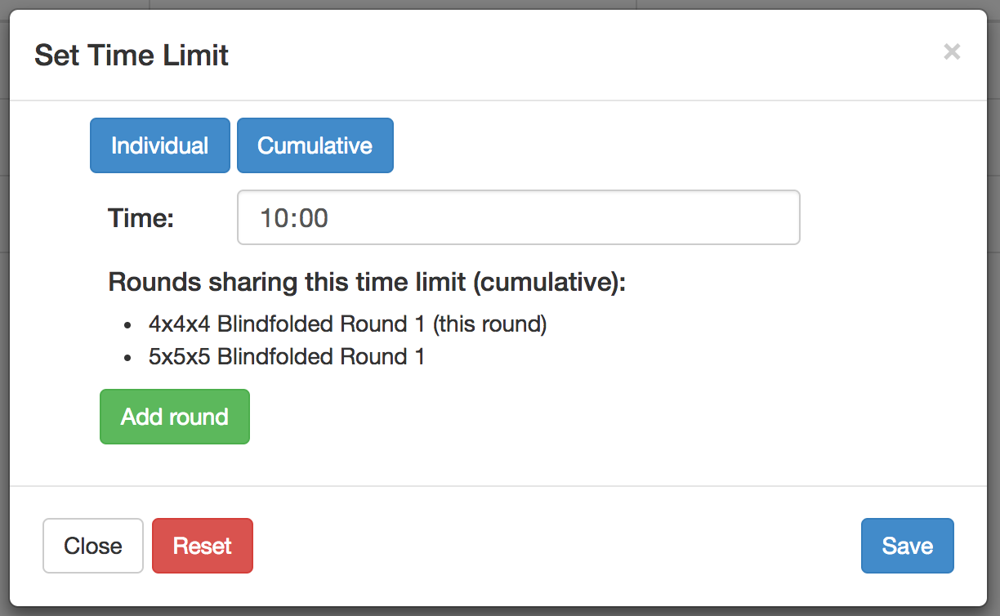
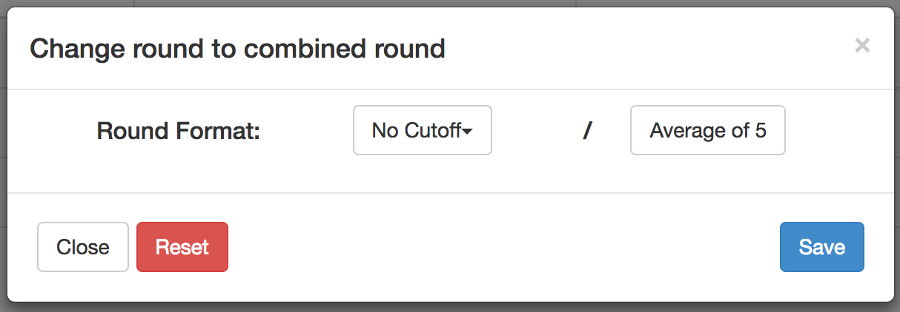
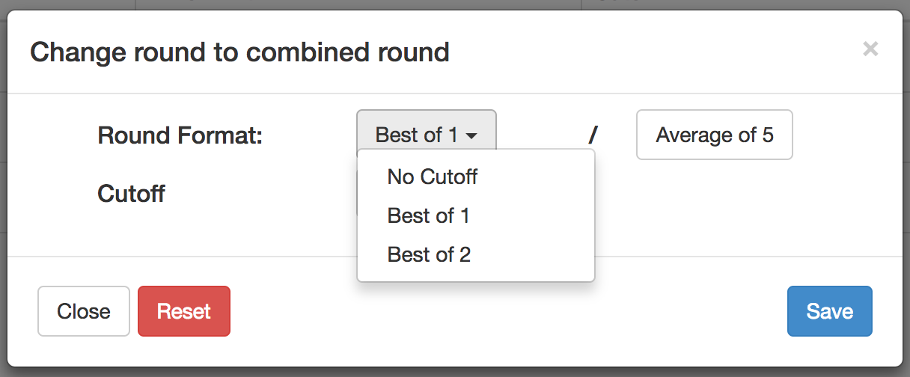
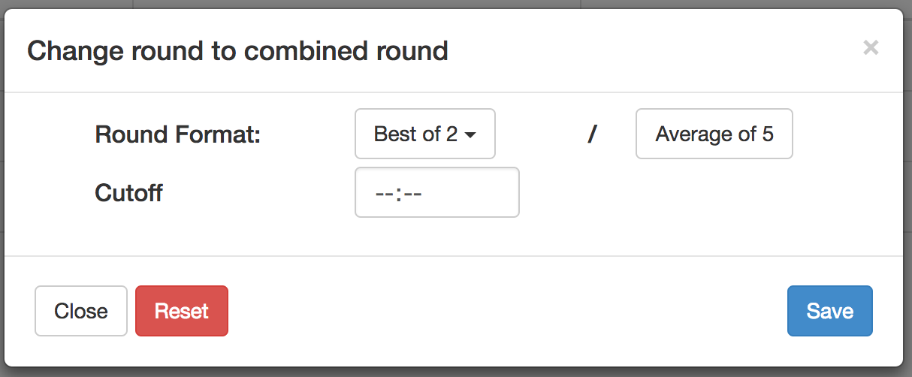
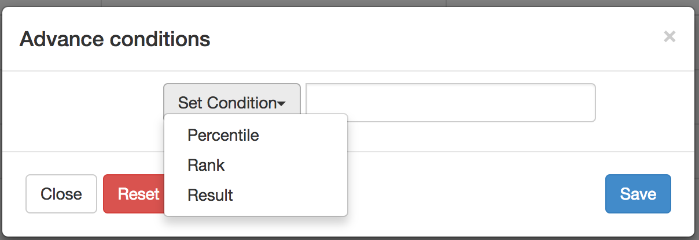

## What is needed?
|            |Time limit   | Cutoff  | Advance   |
|---         |---          |---      |---|
|Speed events| x  | x   | x  |
|FMC         | -  | x  | x  |
|MultiBLD    | -  | x  | x  |

The time limit for FMC and MultiBLD is always 1h. It's not possible to change that. 

## Units
The general approach how time limits, cutoffs and advance conditions are handled is the same for all types of events.
The (important) difference are the units how the results are measured:

* Speed events: time 
* MultiBLD: points
* FMC: moves

## Some restriscitons and conditions
### Time Limits
* Default time limit is 10 minutes for speed events

### Cutoffs
* Number of attempts for "full" round format `>` attempts for first phase of combined round
    * e.g setting the format of the round to "Average of 5 / Best of 1" is not possible
* The cutoff time must not be higher than the time limit.
* It's not a official standard to write the round formats with a "`/`", but I think it's an international unofficial standard. :-)

### Advance conditions
* Percentile `<=` 75% (defined by regs)
* Advance condition `<` Time limit
	* This is not against the regulations, but having an "advance to the next round cutoff" above the time limit is useless. Competitors will not get results above the time limit.

## Some design ideas
### Time limit

#### Individual Time limit
Set the time limit for an individual attempts (default selection):

#### Cumulative Time limit
Set a cumulative time limit. To clarify that this is a cumulative time limit for a single round, the name of the round is shown below.

To add an additional round (and make this a cumulative time limit for 2 events), click on "Add round":

### Cutoff
#### Set Cutoff
The default selection is "None", which means that no cutoff was set for the round:

#### Choose a format
To change this, the format of the combined round has to be chosen. The right side represents the format that was chosen for the round:

#### Add the cutoff time
Selecting a round format for a combined round reveals another row where the cutoff can be added:

### Advance conditions
Three types to choose from:

